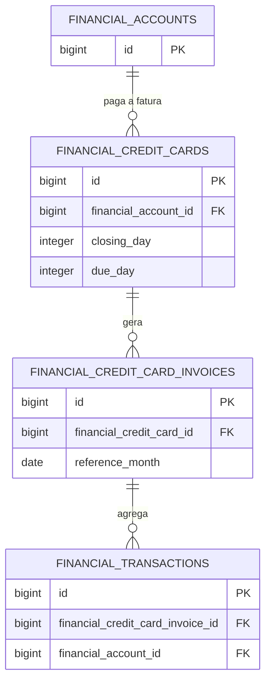

## Visão Geral

O módulo de **Cartões de Crédito** gerencia limites, datas de vencimento/fechamento e o ciclo de vida das faturas (invoices). Um cartão está sempre vinculado a uma [Conta Financeira](/docs/modulos/financas/contas) de onde o dinheiro sairá quando a fatura for paga. O módulo possui inteligência de dias úteis para mover automaticamente datas que caiam em finais de semana ou feriados nacionais.

## Tabelas

### `financial_credit_cards`

| Coluna | Tipo | Descrição |
| --- | --- | --- |
| `id` | bigint | Chave primária. |
| `financial_account_id` | foreignId | Conta corrente vinculada para débito do pagamento. |
| `name` | string | Nome do cartão (Ex: Nubank Platinum). |
| `credit_limit` | decimal | Limite de crédito disponível. |
| `closing_day` | integer | Dia padrão de fechamento da fatura (Ex: 7). |
| `due_day` | integer | Dia padrão de vencimento da fatura (Ex: 2). |
| `deleted_at` | timestamp | Soft deletes (Lixeira). |

### `financial_credit_card_invoices`

| Coluna | Tipo | Descrição |
| --- | --- | --- |
| `id` | bigint | Chave primária. |
| `financial_credit_card_id` | foreignId | Vínculo com o cartão originador. |
| `reference_month` | date | Mês/Ano base da fatura (dia é sempre 01). |
| `closing_date` | date | Data *ajustada* real de fechamento. |
| `due_date` | date | Data *ajustada* real de vencimento. |
| `amount_paid` | decimal | Valor já pago nesta fatura. |
| `paid_at` | date | Data em que a fatura foi totalmente quitada. |
| `interest_transaction_id`| foreignId | Vínculo com a despesa de juros, caso haja pagamento em atraso. |

## Diagrama Relacional (ER)

## Regras de Negócio e Comportamento

### Lógica de Feriados e Dias Úteis
O sistema integra com a `BrasilAPI` (via `BusinessDayHelper`) para buscar os feriados nacionais anuais, mantendo-os em cache permanente.
- O **Fechamento** é empurrado retroativamente para o *dia útil anterior* caso caia em feriado/final de semana.
- O **Vencimento** é empurrado para o *próximo dia útil* caso caia em feriado/final de semana.

### Rolagem e Vinculação de Compras
Ao lançar uma nova compra, o sistema utiliza a função `resolveForDate`. Ela compara a data da transação com a data real (ajustada) de fechamento daquele mês. Se a transação for feita no dia ou antes do fechamento, entra na fatura atual. Se for depois, "rola" automaticamente para a fatura do mês seguinte.
As compras parceladas iteram mês a mês chamando esta mesma função para alocar corretamente cada parcela em sua respectiva fatura.

### Automação (Cron)
Existe um comando (`finance:rollover-invoices`) rodando diariamente à meia-noite via Laravel Schedule. Ele verifica todos os cartões não deletados e invoca `resolveForDate(today)` para garantir que a fatura do mês vigente/próximo mês exista no banco, mesmo que o usuário não faça compras (mantendo a consistência visual).

### Pagamento da Fatura
Quando o pagamento é registrado, o sistema realiza várias ações em cascata:
1. Gera uma despesa "real" na `Conta Corrente` vinculada ao cartão.
2. Caso seja reportado um valor de **Juros**, gera uma despesa extra na conta, aplicando automaticamente a tag `Juros` (código fixo) para isolar este prejuízo nos relatórios.
3. Se o pagamento cobrir o total da fatura, muda o status para `paid` e transforma todas as transações agregadas nela em transações consolidadas (`is_posted = true`), integrando-as de fato aos relatórios financeiros retroativos.

### Exclusão (Soft Deletes)
Cartões não podem ser apagados permanentemente (`forceDelete`) se tiverem faturas ativas, garantindo a integridade dos dados históricos. O mesmo ocorre para contas financeiras que tenham cartões vinculados a elas.
