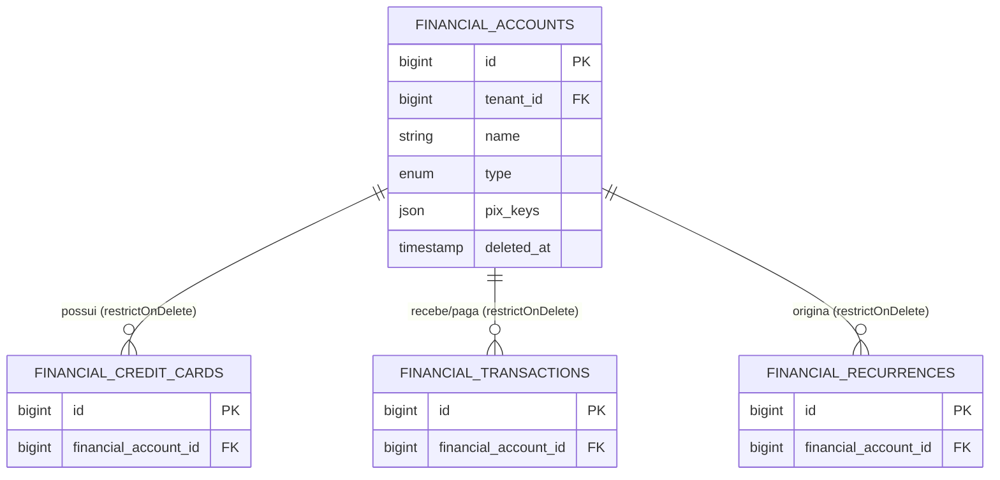

## Visão Geral

As **Contas Financeiras** são a origem e o destino de todas as movimentações do sistema. A arquitetura centraliza tudo em uma única entidade: seja dinheiro em espécie, conta em banco tradicional ou saldo em corretora de investimentos.

## Tabela: `financial_accounts`

| Coluna | Tipo | Descrição |
| --- | --- | --- |
| `id` | bigint | Chave primária. |
| `tenant_id` | foreignId | Contexto do grupo/família. |
| `name` | string | Nome identificador (Ex: Nubank, Carteira). |
| `type` | string | Enum `FinancialAccountType` (checking, investment, wallet). |
| `pix_keys` | json | Array contendo as chaves Pix cadastradas. |
| `deleted_at` | timestamp | Soft deletes (Lixeira). |

## Diagrama Relacional (ER)

O diagrama abaixo ilustra como a tabela de contas age como o pilar central do módulo financeiro. Todas as relações de dependência utilizam `restrictOnDelete` para proteger a integridade dos dados, impedindo a exclusão permanente de uma conta que possua histórico financeiro.

## Regras de Negócio e Comportamento

- **Exclusão Segura (Soft Deletes & Constraints):** Contas podem ser deletadas e enviadas à lixeira sem problemas. Contudo, a **exclusão permanente** (`forceDelete`) é estritamente bloqueada (tanto via aplicação quanto por `restrictOnDelete` no banco) se a conta possuir cartões de crédito, transações ou recorrências vinculadas.
- **Ícones Dinâmicos (SSOT):** O Enum `FinancialAccountType` centraliza a inteligência de UI através do método `icon()`, garantindo que o componente `<x-ui.avatar>` sempre exiba o ícone correto de acordo com a natureza da conta, eliminando a necessidade de salvar imagens e cores no banco.
- **Chaves Pix:** O banco armazena via JSON, e a interface reage ativando a adição de chaves exclusivamente quando o tipo selecionado for Conta Corrente.

## Métricas (Dashboard da Conta)

A tela de visualização (`show`) atua como uma pequena central analítica para aquela conta específica, calculando dinamicamente:
- **Receitas:** Somatório total de transações de entrada consolidadas.
- **Despesas:** Somatório total de transações de saída consolidadas.
- **Saldo Atual:** Resultado líquido. Possui design responsivo (verde para positivo, vermelho para negativo, neutro para zero).
