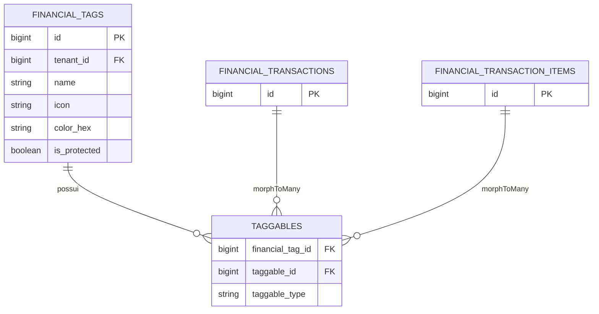

## Visão Geral

As **Tags Financeiras** substituem o conceito clássico e engessado de "Categorias". Elas oferecem liberdade para classificar transações ou itens de transação sob múltiplas perspectivas sem a necessidade de árvores complexas de "Categoria > Subcategoria".

## Tabela: `financial_tags`

| Coluna | Tipo | Descrição |
| --- | --- | --- |
| `id` | bigint | Chave primária. |
| `tenant_id` | foreignId | Contexto do grupo/família. |
| `name` | string | Nome identificador (único por tenant). |
| `icon` | string | Nome do ícone da biblioteca SVG (ex: heroicon-o-home). |
| `color_hex` | string | Código de cor hexadecimal associado à tag. |
| `is_protected` | boolean | Flag que impede edição ou exclusão das tags obrigatórias do sistema. |
| `created_at` | timestamp | Data de criação. |
| `updated_at` | timestamp | Data da última atualização. |

## Tabela Auxiliar: `taggables` (Polimórfica)

Para garantir flexibilidade, a relação é polimórfica através da tabela `taggables`. Isso permite vincular tags a entidades diversas:
- Diretamente em uma **Transação Completa** (`financial_transactions`)
- Apenas em um **Item da Transação** (`financial_transaction_items`), ideal para separar impostos, juros e produtos de uma única Nota Fiscal.

## Diagrama Relacional (ER)

## Regras de Negócio e Comportamento

- **Exclusão Definitiva (Hard Deletes):** Tags não possuem Lixeira (soft deletes). Porém, a exclusão é estritamente bloqueada na aplicação e via banco de dados caso a tag já esteja associada a alguma transação ou item. Se ela estiver limpa, é deletada definitivamente.
- **Tags de Sistema Protegidas:** As tags estruturais (ex: *Reembolso*, *Juros*, *Saldo Inicial*) são semeadas pelo sistema com a flag `is_protected = true`. O usuário não pode deletar nem editar seu nome ou cor.
- **Validação Dinâmica de Ícones:** O sistema não salva apenas strings estáticas; a criação e edição usam a regra global `ValidIcon`, que se comunica diretamente com o mecanismo do *Blade UI Kit* para garantir que o ícone informado realmente existe no projeto.
- **Seeder Flexível:** Quando um novo ambiente é configurado,tags padrão sugeridas (como *Alimentação*, *Mercado*, *Lazer*) são inseridas desprotegidas no banco através do `FinancialTagSeeder`. O usuário já encontra uma interface amigável, mas mantém o poder de apagá-las ou editá-las livremente.
- **Seleção Avançada na Interface:** A criação de tags disponibiliza um seletor customizado de cores (`<x-ui.color-picker>`) e uma interface de grid de ícones em tempo real com excelente usabilidade via teclado e mouse.
