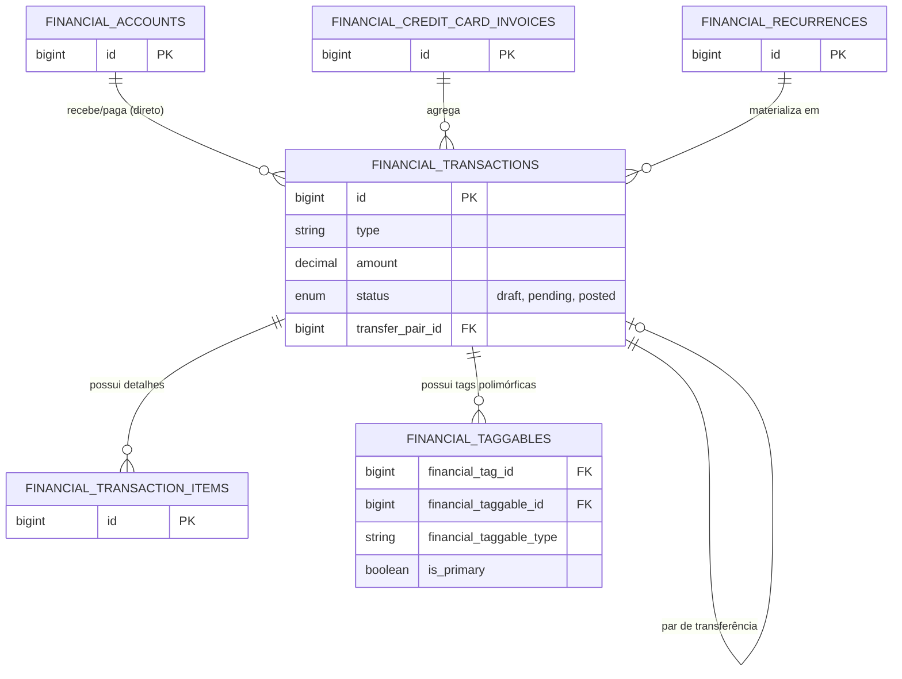

## Visão Geral

As **Transações** são o coração do módulo financeiro. Elas representam qualquer movimentação de dinheiro no sistema, seja uma receita, uma despesa ou uma transferência entre contas. Uma transação pode estar vinculada diretamente a uma Conta Financeira ou indiretamente via uma Fatura de Cartão de Crédito.

## Tabelas

### `financial_transactions`

| Coluna | Tipo | Descrição |
| --- | --- | --- |
| `id` | bigint | Chave primária. |
| `financial_account_id` | foreignId | (Opcional) A conta bancária onde a transação ocorreu. |
| `financial_credit_card_invoice_id` | foreignId | (Opcional) A fatura de cartão de crédito à qual esta compra pertence. |
| `financial_recurrence_id` | foreignId | (Opcional) A recorrência que gerou esta transação. |
| `transfer_pair_id` | bigint | (Opcional) ID da transação correspondente (par) em caso de transferência. |
| `type` | enum | `income` (receita) ou `expense` (despesa). |
| `amount` | decimal | Valor total da transação. |
| `description` | string | Descrição/Título da movimentação. |
| `date` | date | Data em que a transação ocorreu. |
| `status` | string | Enum `TransactionStatus` (`draft`, `pending`, `posted`). |
| `installment_current` | integer | (Opcional) Qual parcela é esta (ex: 1). |
| `installment_total` | integer | (Opcional) Total de parcelas (ex: 12). |

### `financial_transaction_items`

Permite a divisão de uma única transação em múltiplos itens para categorização mais granular.

| Coluna | Tipo | Descrição |
| --- | --- | --- |
| `id` | bigint | Chave primária. |
| `financial_transaction_id` | foreignId | Transação pai. |
| `description` | string | Descrição do item específico. |
| `quantity` | decimal | Quantidade. |
| `unit_price` | decimal | Preço unitário. |

## Diagrama Relacional (ER)

## Regras de Negócio e Comportamento

### Ciclo de Vida e Status (`TransactionStatus`)

O status da transação é gerenciado pelo Enum `App\Enums\TransactionStatus`:

- **Rascunho (`TransactionStatus::Draft` / `'draft'`)**: Utilizado para lançamentos parciais, rascunhos de conciliação ou importações pendentes de revisão.
- **Pendente (`TransactionStatus::Pending` / `'pending'`)**: Indica que a transação está prevista para acontecer (compras futuras, despesas não pagas, compras em faturas de cartão ainda abertas).
- **Efetivada (`TransactionStatus::Posted` / `'posted'`)**: O fluxo de caixa real aconteceu. Transações efetivadas impactam diretamente o saldo real consolidado da conta.
- Ao criar compras parceladas ou transferências, o sistema avalia automaticamente se a data da transação é hoje ou no passado para defini-la como efetivada (`posted`). Caso a data seja futura, ela nasce como pendente (`pending`).

### Anexos e Comprovantes (Spatie MediaLibrary)

O modelo `FinancialTransaction` implementa a interface `HasMedia` com a coleção privada `attachments`. É possível anexar comprovantes de pagamento, recibos fiscais em PDF ou imagens diretamente na tela de criação/edição. Os arquivos são armazenados no disco privado (`attachments`), garantindo privacidade total.

### Parcelamentos

A criação de compras parceladas (via método `createInstallmentsOnAccount`) gera automaticamente as `N` transações futuras no banco de dados. 
Cada transação recebe a data deslocada mensalmente, e possui metadados de controle (`installment_current` e `installment_total`) para facilitar a identificação visual ("1/12", "2/12", etc.). O valor total é dividido, e eventuais centavos de arredondamento são somados à última parcela.

### Transferências

As transferências não possuem uma entidade própria; elas são representadas por **duas** transações vinculadas entre si:
1. Uma transação do tipo `expense` na conta de Origem.
2. Uma transação do tipo `income` na conta de Destino.
3. Ambas compartilham o mesmo `transfer_pair_id` apontando para o ID da despesa geradora.
4. Automaticamente recebem a tag protegida de "Transferência" (`FinancialTag::TRANSFERENCIA_ID`) para que relatórios financeiros possam ignorá-las sem distorcer o fluxo de caixa líquido.
5. Em caso de taxa bancária associada à transferência, uma 3ª transação (despesa) é gerada na conta de origem separadamente.

### Soft Deletes e Proteção em Cascata

Se uma das pernas de uma transferência for excluída, o sistema intercepta o evento de *deleting* e apaga automaticamente a transação correspondente (par) para manter a coerência financeira. Deleções definitivas (`forceDelete`) também forçam a purga da contraparte.

